## What Is Fourier Transform

When you play a middle C on piano, you press a key and a sound wave comes out. Imagine you had the opposite, a machine that can hear a sound wave and tell you which the note it is on the piano.

But more generally: a full chord into a set of keys to strike and how hard to strike each one.

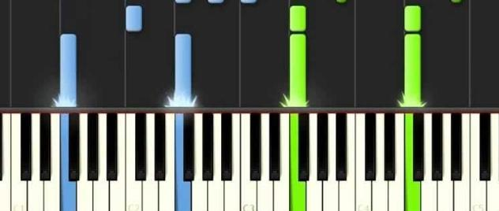

That's what a Fourier Transform does: It converts a signal into the set of frequencies that will recreate it

<video src="fourier_transform.mp4" controls=""></video>

Fourier transform can be inverted by adding waves back together.

<video src="frequency_domain.mp4" controls=""></video>

## Discrete Fourier Transform (DFT)

Real world signals are **finite and discrete**, not infinite or continuous.

The DFT transforms a **finite, discrete time-domain signal** into its **frequency-domain representation**.

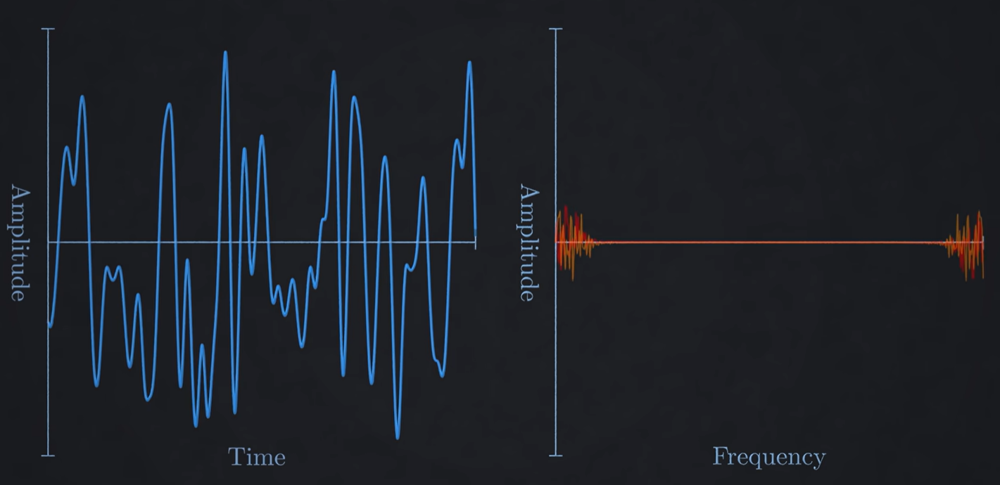
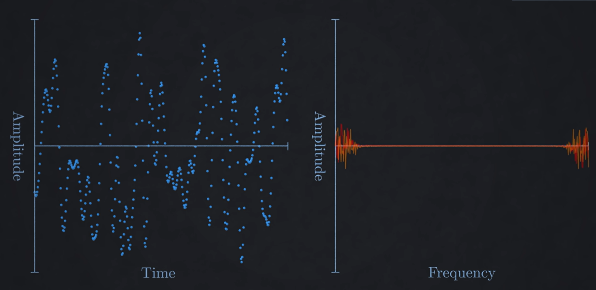

### Calculating DFT

The DFT measures how much a signal correlates with sine and cosine waves at different frequencies. Mathematically, this is an inner product between the sin and cos waves at different frequencies. If the inner product is near zero, that frequency is not present in the signal
$$
X[k] = \sum_{n=0}^{N-1} x[n]\; e^{-j \frac{2\pi}{N}kn},
\quad k = 0, 1, \dots, N-1
$$


```odin
// n: Total number of samples.
// i: The current sample index in time.
// k: The current frequency being tested
samples : []float
output  : []complex

for k in 0..<n {
    for i in 0..<n {
        angle := 2.0 * pi * k * i / n
        output[k] += complex(samples[i] * cos(angle), -samples[i] * sin(angle))
    }
}
```

### Sample rate

To avoid aliasing, the sampling rate must be **strictly greater than** twice the highest frequency in the signal (Shannon–Nyquist Sampling Theorem)
Human hearing extends to ~20 kHz → most audio is typically sampled at 44.1 kHz or 48 kHz

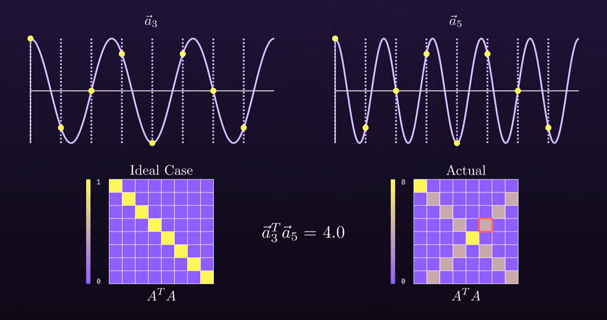
.png)

### Phase Alignment

When we use only cos or sin waves, **changes in phase affect our output** even though the frequency of the waves hasn't changed.

<video src="phase_problem.mp4" controls=""></video>

Using **both sin and cos captures amplitude and phase**. These can be combined into a **complex exponential**, which fully represents each frequency component.

<video src="phase_solution.mp4" controls=""></video>

## Fast Fourier Transform (FFT)

Computing the DFT directly takes O(n^2) time, which is too slow for large signals
FFT computes DFT in O(n log n) time
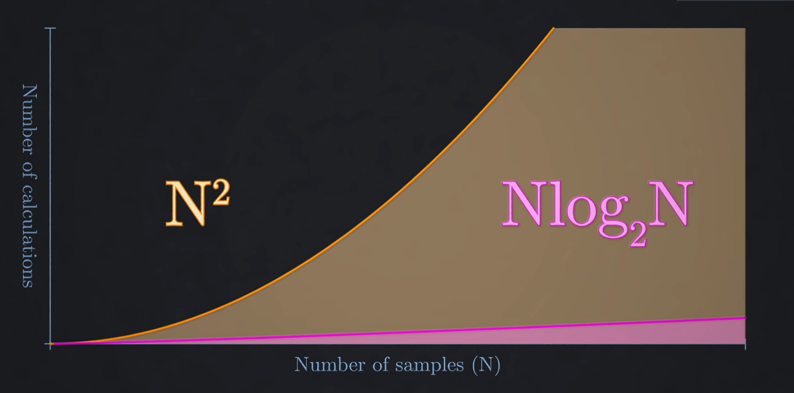

The most common FFT is the Cooley–Tukey algorithm, which uses divide-and-conquer
Although similar ideas can be found at gauss'es textbook Cooley and Tukey popularized it in 1965

FFT efficiency comes from exploiting the symmetry and periodicity of roots of unity
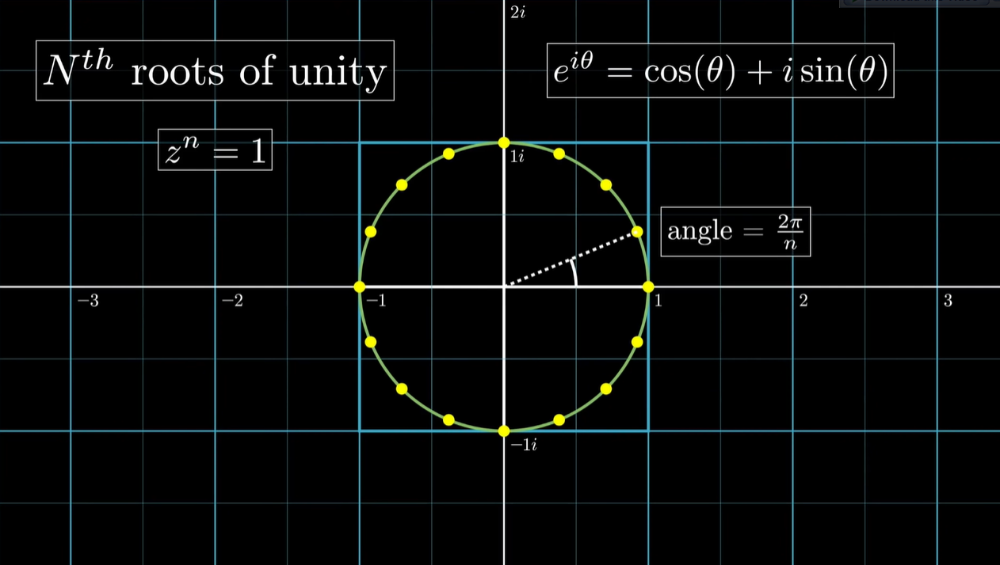

FFT is a recursive algorithm but most implementations use bit traversal to emulate recursion
Here is a very naive implementation using recursion:

```odin
fft :: proc(a: []complex64) {
    n := len(a)
    if n <= 1 {
        return
    }

    even := make([]complex64, n/2)
    odd  := make([]complex64, n/2)
    defer delete(even)
    defer delete(odd)

    for i in 0..<n/2 {
        even[i] = a[2*i]
        odd[i]  = a[2*i + 1]
    }

    fft(even)
    fft(odd)

    for k in 0..<n/2 {
        angle := -2.0 * math.PI * f64(k) / f64(n)
        w := complex64(math.cos(angle), math.sin(angle))
        a[k]       = even[k] + w * odd[k]
        a[k+n/2]   = even[k] - w * odd[k]
    }
}
```

## Real-World Applications

- JPEG compression uses the **Discrete Cosine Transform (DCT)**, which is closely related to the DFT
  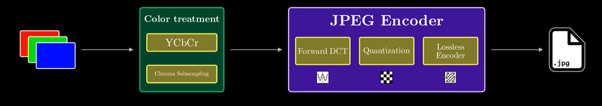
  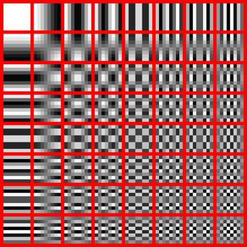

- Fast polynomial multiplication can be done in **O(N log N)** using **FFT**
  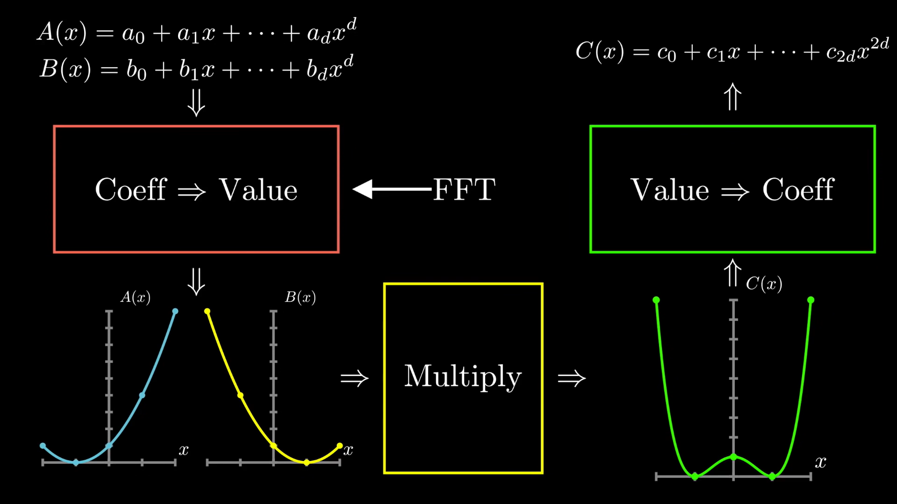

- Music Equlizers
  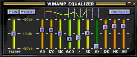

- Edge Dedection
  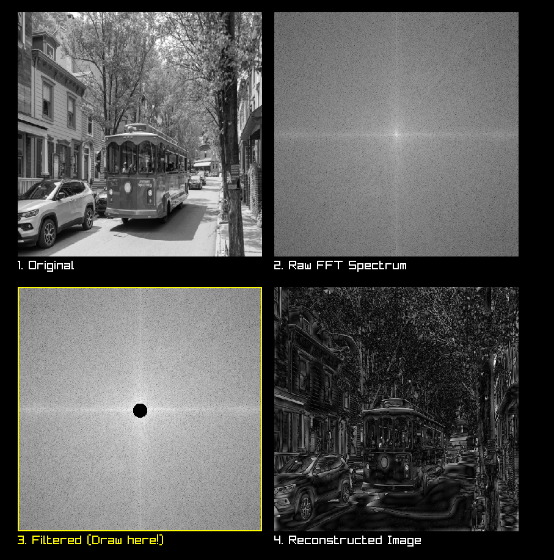

- Unreal Engine 5 uses convolution bloom (FFT based) instead of traditional downsampling method

  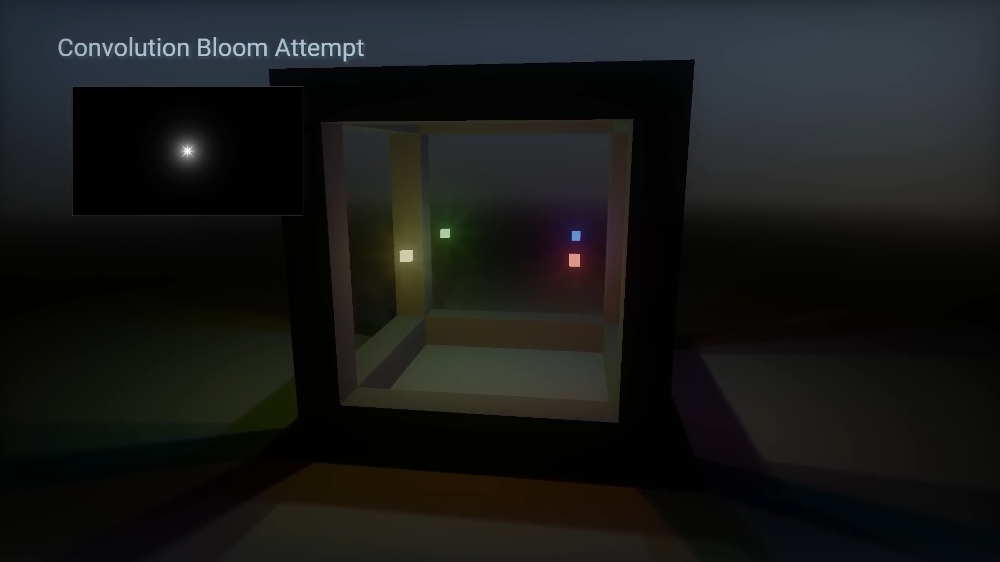

- A 2D DFT is computed by applying FFTs to all rows and then all columns (order doesn’t matter)
  For visualization, the frequency image is often shifted so the zero-frequency (DC) component is at the center
  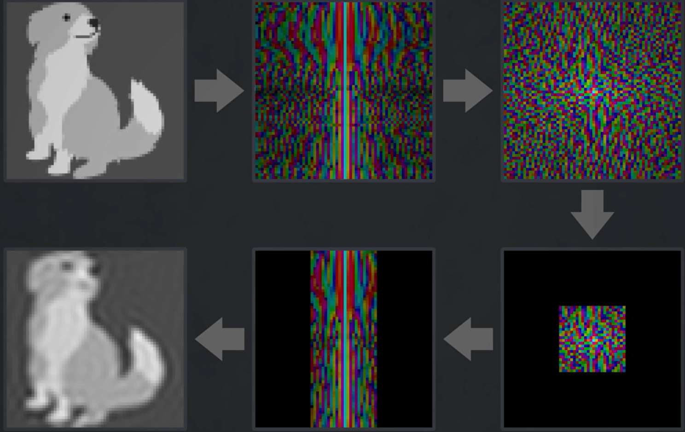

- [Waver](assets/https://waver.ggerganov.com/)

- Shazam

- Underground Nuclear Dedection

- Wifi

## Other related things Fourier Transform

Human ear does something similar to a fourier transform. It detects sound waves by using resonance they caused in different areas in the ear cochlea

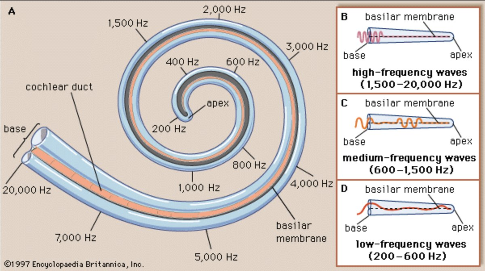


Radios use a similar method with DFT but instead of calculating each frequency they only calculate one

When resonance frequency is same all the other waves cancel out and you get original amplitude

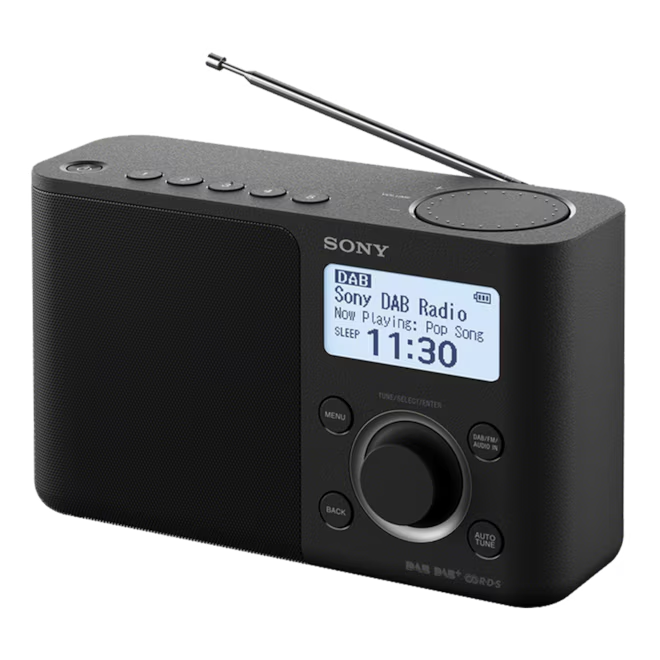